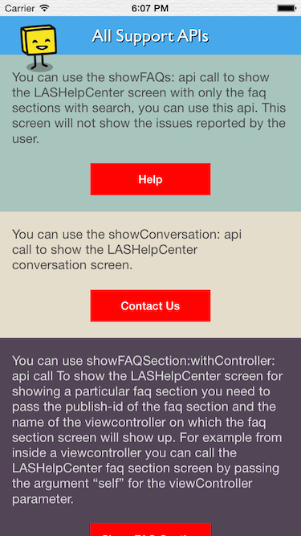
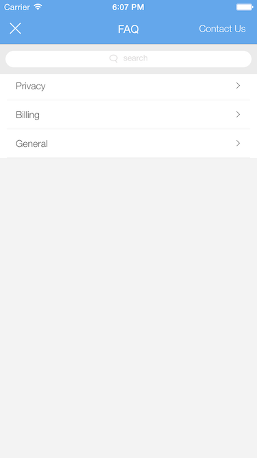
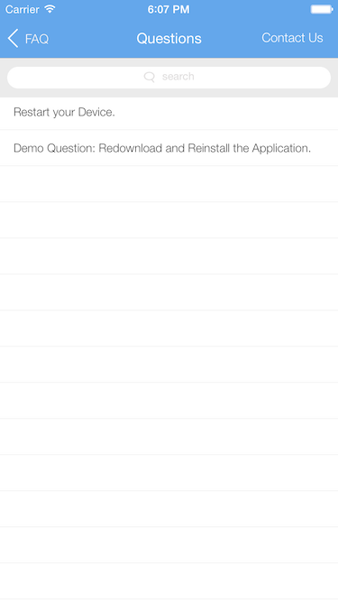
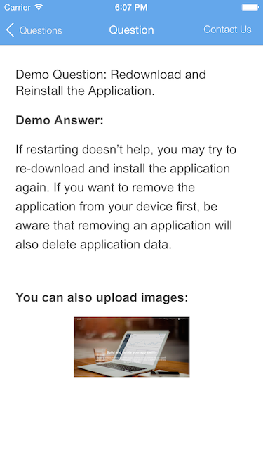
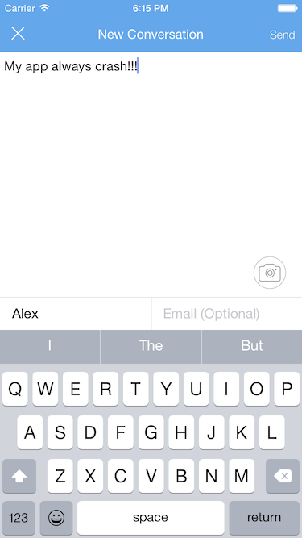
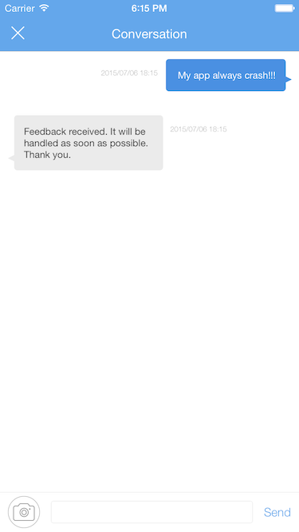

# Demo-Support-iOS

## Overview

The project teaches you how to use FAQ and Feedback function in MLHelpCenter.

## Features

- Show FAQ
- Users Feedback

## Screenshots

## How to Run

- Clone the repository and open the project.
- Create an app in leap.as console and name it MaxLeap App. You can skip this step if you've already created one. 
- Add your applicationID and clientKey in `AppDelegate.`. 
- Press <kbd>Command</kbd> + <kbd>R</kbd> to run it. 

## Project Dependencies

- `MaxLeap.framework` -- Basic module of MaxLeap iOS SDK and all other MaxLeap modules are build on it. 
- `MLHelpCenter.embededframework`

## Usage

### Show FAQ Interface

`[[MLHelpCenter sharedInstance] showFAQs:currentDisplayingViewController];`

### Show Feedback Interface

`[[MLHelpCenter sharedInstance] showConversation:currentDisplayingViewController];`

### New Message Alert

The default configuration enables network connection and will check if there is any unread messages everytime the app enters Foreground. If so, there will be a popup. You can close this reminder when run the app.

`[MLHelpCenter alertNewMessage:NO];`

## Documents

FAQ: https://leap.as/docs/appFaqs/ios.html

Feedback：https://leap.as/docs/appIssues/ios.html

